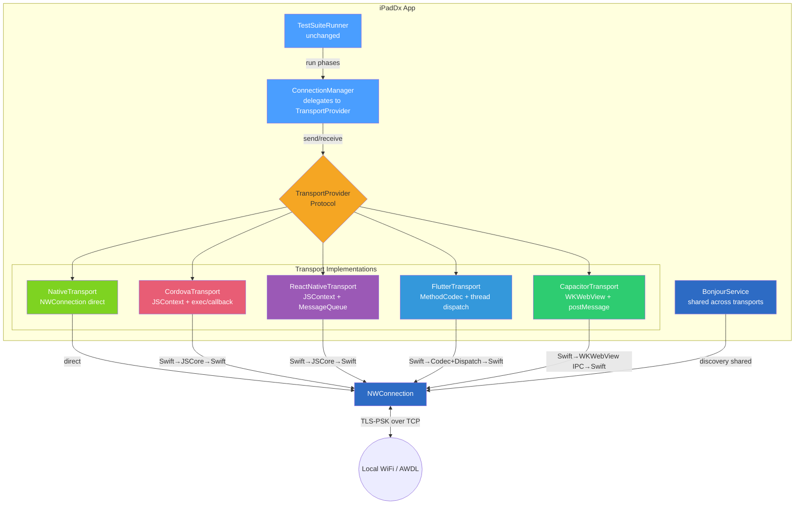
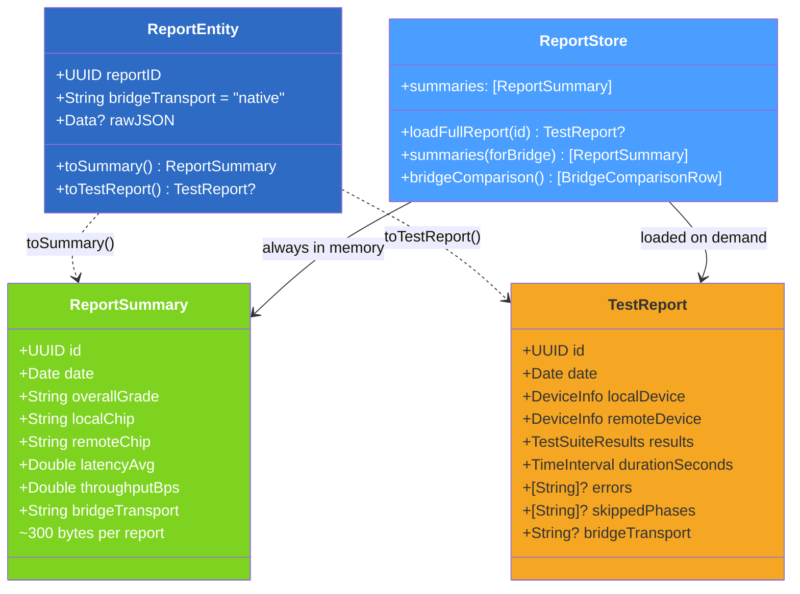
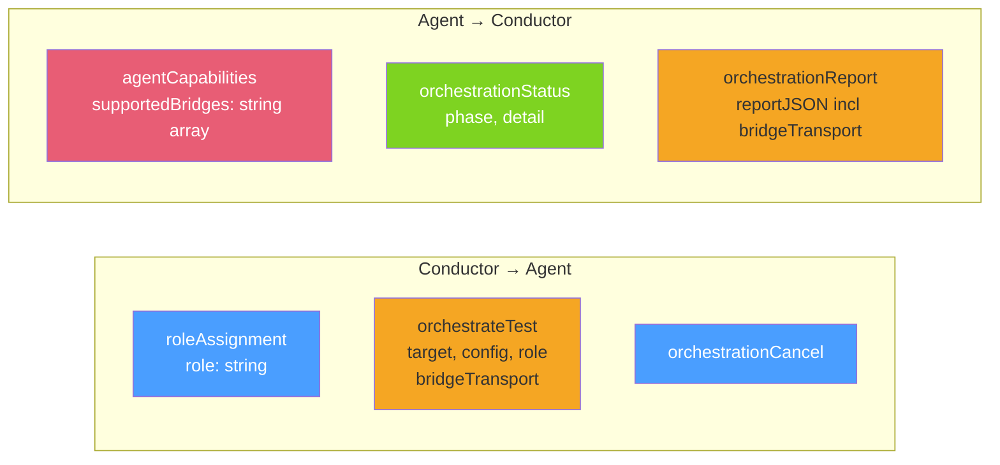
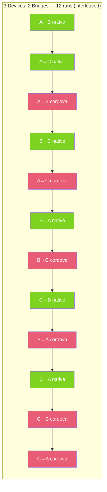

# Bridge Transport — Architecture & Flow Diagrams

> **Status:** Implemented. These diagrams reflect the current codebase.

See [current_architecture.md](current_architecture.md) for the base architecture without bridges.

---

## Component Stack — With Bridges



---

## Bridge Internal Data Paths

### Cordova (JSContext)

```
Send: Swift → base64 → JSContext exec() → command queue → JSON batch → parse → callback → base64 → Swift → NWConnection
Recv: NWConnection → Swift → base64 → JSContext event dispatch → JSON serialize/parse → callback → base64 → Swift
```

### React Native (JSContext)

```
Send: Swift → base64 → JSContext enqueueNativeCall → MessageQueue batch → JSON flush → parse → invokeCallback → base64 → Swift → NWConnection
Recv: NWConnection → Swift → base64 → JSContext event → MessageQueue → JSON flush → parse → callback → base64 → Swift
```

### Flutter (No Dart VM — see shortcuts in bridge_overhead.md)

```
Send: Swift → StandardMethodCodec encode → DispatchQueue hop (platform thread) → decode → encode result → DispatchQueue hop (main thread) → decode → Swift → NWConnection
Recv: NWConnection → Swift → StandardMethodCodec encode → DispatchQueue hop → decode → encode → DispatchQueue hop → decode → Swift
```

### Capacitor (WKWebView — real cross-process IPC)

```
Send: Swift → evaluateJavaScript("toNative(...)") → [WebKit IPC: App→WebContent] → JS serialize → postMessage → [WebKit IPC: WebContent→App] → Swift → NWConnection
Recv: NWConnection → Swift → evaluateJavaScript("triggerEvent(...)") → [WebKit IPC] → JS process → postMessage → [WebKit IPC] → Swift
```

---

## Native vs Cordova — Overhead Comparison

```mermaid
flowchart TB
    subgraph "Native Transport Path"
        direction LR
        NA[Swift send] --> NB[NWConnection] --> NC[TCP/TLS] --> ND[NWConnection] --> NE[Swift receive]
    end

    subgraph "Cordova Transport Path (both sides bridged)"
        direction LR
        CA[Swift send] --> CB[JSContext<br/>exec + queue] --> CC[JSON<br/>batch flush] --> CD[NWConnection] --> CE[TCP/TLS] --> CF[NWConnection] --> CG[JSContext<br/>event + callback] --> CH[Swift receive]
    end

    style NA fill:#7ed321,color:#fff
    style NB fill:#7ed321,color:#fff
    style NC fill:#7ed321,color:#fff
    style ND fill:#7ed321,color:#fff
    style NE fill:#7ed321,color:#fff

    style CA fill:#4a9eff,color:#fff
    style CB fill:#e85d75,color:#fff
    style CC fill:#e85d75,color:#fff
    style CD fill:#4a9eff,color:#fff
    style CE fill:#4a9eff,color:#fff
    style CF fill:#4a9eff,color:#fff
    style CG fill:#e85d75,color:#fff
    style CH fill:#4a9eff,color:#fff
```



---

## Updated Report Data Model



---

## Orchestration Protocol



---

## Queue Interleaving


