# iPadDx — Current Architecture & Flows

How iPadDx works today. Native Swift on Network.framework with pluggable bridge transports. See [bridge_overhead.md](bridge_overhead.md) for bridge transport details.

---

## Component Stack

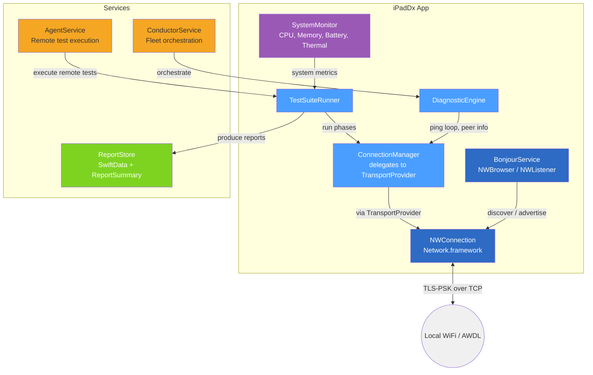

Two conventions that affect how the numbers should be read:

- **CPU is a percentage of the whole device, 0–100.** `SystemMonitor` sums each live thread's `cpu_usage` (scaled to `TH_USAGE_SCALE`, one saturated core) and divides by `activeProcessorCount`. The per-core-sum convention used by `top` — where one busy thread reads 100% and the ceiling is 100 × cores — is deliberately not used, because a device-wide percentage stays comparable across chips with different core counts, which is the point of this tool. Every consumer (dashboard gauges, test reports, responder metrics) reads that one scale, exposed as `SystemMonitor.cpuUsageConvention` so the UI can label it.
- **The chip family comes from the hardware model identifier.** `DeviceIdentifier` looks `iPad16,3` up in `iPadCatalog`, which names the exact chip. `hw.cpufamily` is consulted only for hardware the catalog does not know yet, and for the core families that ship in more than one chip it returns the shared label (`A14/M1`, `A15/M2`) rather than guessing — sysctl physically cannot tell those apart.

`SystemMonitor.ThermalTracker` records thermal state *transitions* during a run, which land in `SystemMetricsResult.thermalTransitions` alongside the single worst state.

---

## Operating Modes

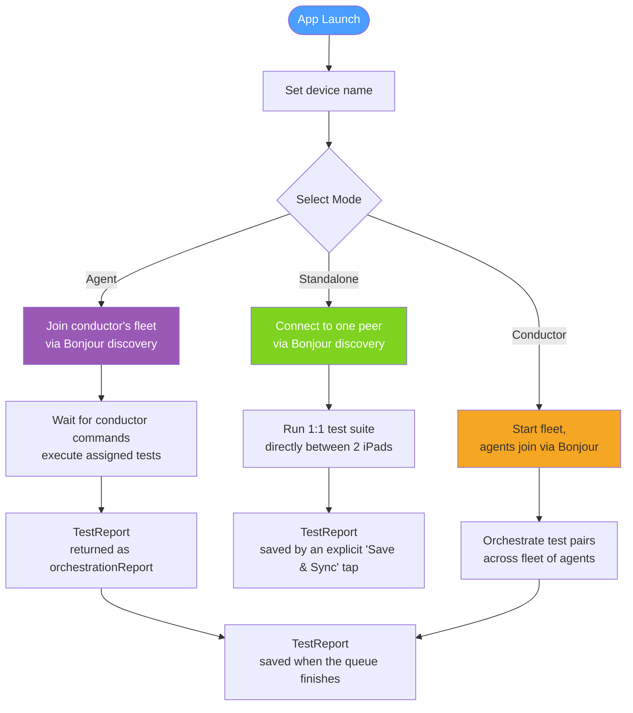

Reports are not persisted automatically in every mode:

- **Standalone** — the run produces a `TestReport` in memory. It is written to `ReportStore` only when the user taps **Save & Sync**, which also pushes a `reportSync` copy to the peer.
- **Conductor** — reports collected during a queue are saved with source `"conductor"` once `runQueue` returns. "Re-run Failed" preserves the earlier results and saves only the reports it did not already save.
- **Agent** — an agent does not save its own report; it sends it to the conductor as `orchestrationReport`.

---

## Connection Lifecycle

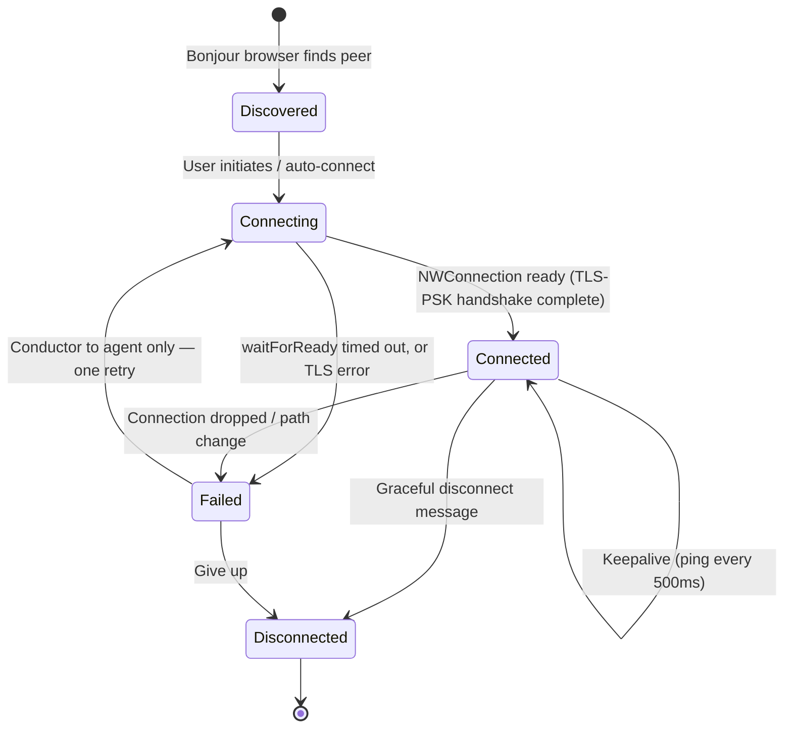

Timeouts differ by path:

- **15s on most paths.** `ConnectionManager.waitForReady` defaults to 15s and is used at that value for the standalone outbound connect, the inbound accept in `BonjourService`, the conductor's reverse-test accept, and the agent's controller and responder partner connections. TCP `connectionTimeout` is also set to 15.
- **20s with one retry, conductor → agent.** `ConductorService.connectToDevice` waits 20s; if the connection is not ready it disconnects, waits 1s, reconnects and waits another 20s. If the second attempt also fails the device is removed from the fleet.
- **A failed inbound handshake is torn down.** When an accepted connection never reaches ready, the engine is stopped, the manager is disconnected, the `NWConnection` is cancelled and the stored references are cleared. Previously the half-open state remained, so every later inbound connection was rejected as a duplicate.

Every lost connection fires `ConnectionManager.onDisconnect(reason, detail)`. `DiagnosticEngine.start()` wires that callback to `DiagnosticMetrics.logDisconnect`, which is the sole writer of the disconnect history — engine teardown for an ordinary mode change does not count as a disconnect. Reasons come from `classifyError`, which pattern-matches the real `NWError` cases (POSIX code, TLS, DNS) rather than searching the error text.

---

## Message Protocol

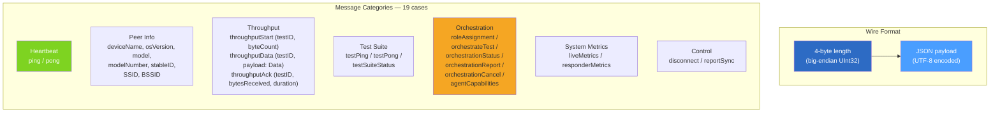

`enum DiagnosticMessage` has 19 cases. Notes on the less obvious ones:

- **`throughputData(testID:payload:)`** carries real bytes. The payload comes from `ThroughputPayload`, which builds a 32 KB pseudo-random buffer once and reuses it — pseudo-random rather than zero-filled so no layer can compress it away, reused so the sender's own cost stays negligible. `ThroughputPayload.chunk(ofSize:)` returns the shared buffer for a full chunk and a prefix of it for the short final chunk.
- **`throughputAck(testID:bytesReceived:duration:)`** travels from the *receiver* back to the sender. It is the authoritative measurement: the sender never derives a rate from its own send loop.
- **`agentCapabilities(supportedBridges:appVersion:iosVersion:)`** is how an agent advertises which bridge transports it can actually run. The conductor stores it on the `DeviceConnection` and checks it in `validateBridgeSupport` before dispatching a bridged run.
- **`liveMetrics(cpu:memoryMB:thermalState:timestamp:)`** is broadcast by the responder every 2s while a remote test is running, and feeds the live remote-metrics display. **`responderMetrics(...)`** is the single summary (peak/avg CPU, peak memory, worst thermal state, battery drain) sent once when the controller signals that the suite has ended.

---

## Standalone Test Flow

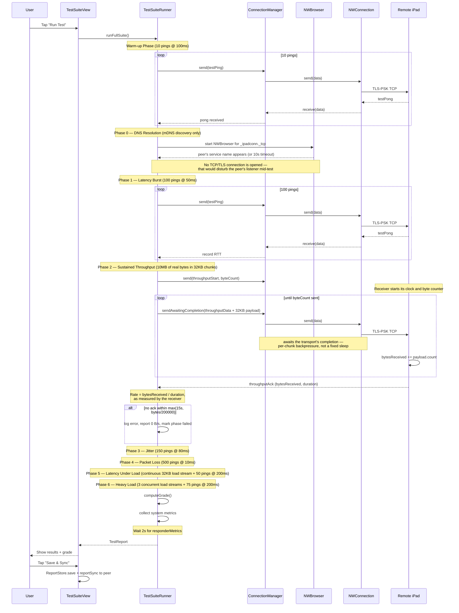

Seven phases — the runner numbers them 0 to 6, matching `TestPhase.allCases` — all enabled by default in `TestSuiteConfig` (`TestSuiteConfig.quick` disables DNS Resolution, Latency Under Load and Heavy Load). Points worth knowing:

- **The report is not saved automatically.** `runFullSuite()` returns a `TestReport` and the completed view offers **Save & Sync**; nothing reaches `ReportStore` until that is tapped.
- **Throughput is measured by the receiver.** `DiagnosticEngine` counts arriving `throughputData` bytes against the `throughputStart` byte count and replies with `throughputAck`. The sender reports that number and nothing else. If the peer never acks, the ack wait (`max(15s, bytes / 200_000)`) expires, the phase records 0 B/s, an error is logged and the phase is marked `.failed("Transfer not acknowledged")`. The receiver has its own 60s stall timeout: it acks whatever genuinely arrived so a dropped sender produces a real (degraded) rate rather than a hang.
- **The load phases apply real load.** Phases 5 and 6 use `startLoadGenerator`, which streams genuine 32 KB chunks with per-chunk backpressure for the entire measurement window under a `testID` the peer is not tracking — the bytes load the link but are not counted into any throughput result.
- **Phases can fail.** A phase that collects nothing is recorded as `PhaseStatus.failed(reason)` with an entry in the report's `errors`, instead of being reported as completed.
- **Cancelling produces a partial report.** Every phase loop checks the cancel flag and a cancelled run breaks out of the phase sequence, keeping everything gathered so far. Remaining phases are marked skipped, `"Test cancelled by user — this is a partial report"` is appended to `errors`, and the report is still returned.

---

## Conductor Fleet Flow

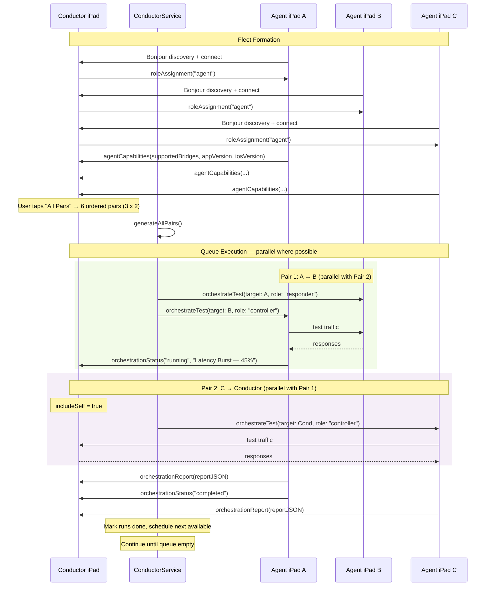

Behaviour worth calling out:

- **Bridged runs only happen agent-to-agent.** `orchestrateTest` carries the bridge transport, and `AgentService` builds a fresh `ConnectionManager` with that transport on both the controller and the responder side, so the bytes really cross the bridge on both ends. Before dispatching, `validateBridgeSupport` checks that both devices advertised the bridge in `agentCapabilities`; if not, the run is recorded as a failure and never sent (a capability gap is not transient, so it is not retried).
- **The conductor cannot be a bridged endpoint.** Its fleet connection to each agent is created natively when the device joins, long before a bridge is chosen. A self-run with a non-native bridge is refused and recorded as a failure rather than producing a report labelled with a bridge that never carried the bytes.
- **Failures are retried, then recorded.** Real failure paths call `handleRunFailure`, which retries up to `maxRetries` (default 2) after `retryDelay` (default 5s) and otherwise appends the run to `failedRuns`.
- **Nothing is silently dropped.** If the loop can neither launch nor await anything, the remaining runs are logged and appended to `failedRuns` instead of vanishing into a "all tests completed" message.
- **Controls gate on `isQueueRunning`, not `queueStatus`.** `.completed` is a terminal, non-idle state; gating on `queueStatus == .idle` left every control disabled after the first queue finished.
- **Cancellation reaches the conductor's own suite.** `cancelQueue()` calls `selfRunner?.cancel()` explicitly — cancelling the wrapper `Task` is not enough, because the runner's pacing delays are `try? await Task.sleep`, which throws instantly in a cancelled task and gets swallowed, letting the suite race through its remaining phases.
- **Cancellation reaches the agents too.** `orchestrationCancel` makes `AgentService.cancelTest()` call `testRunner?.cancel()` before tearing the partner connection down. The agent still sends the partial report as `orchestrationReport`, then reports phase `"cancelled"` rather than `"completed"`.

---

## Test Pair Generation

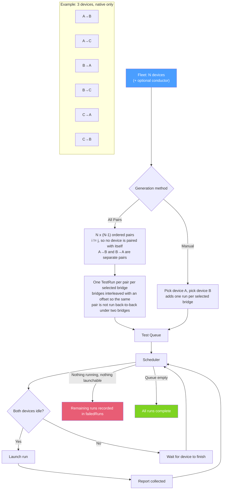

`generateAllPairs()` iterates every ordered `(i, j)` over the connected agents — plus the conductor itself when `includeSelf` is on — skipping `i == j`. Three devices therefore give 6 pairs, not 9. Each pair becomes one `TestRun` per selected bridge transport.

---

## Report Data Model

```mermaid
classDiagram
    class TestReport {
        +UUID id
        +Date date
        +DeviceInfo localDevice
        +DeviceInfo remoteDevice
        +TestSuiteResults results
        +TimeInterval durationSeconds
        +[String]? errors
        +[String]? skippedPhases
        +String? bridgeTransport
    }

    class DeviceInfo {
        +String name
        +String model
        +String modelNumber
        +String osVersion
        +String chipFamily
        +String displayModel
        +String shortDescription
        +String pairDescription
    }

    class TestSuiteResults {
        +LatencyBurstResult latencyBurst
        +ThroughputResult sustainedThroughput
        +JitterResult jitterMeasurement
        +PacketLossResult packetLossStress
        +LatencyUnderLoadResult latencyUnderLoad
        +SystemMetricsResult systemMetrics
        +String overallGrade
        +ResponderMetricsResult? responderMetrics
        +DNSResolutionResult? dnsResolution
        +HeavyLoadResult? heavyLoad
    }

    class LatencyBurstResult {
        +Double min / max / avg / median / p95
        +Int sampleCount
        +[Double] samples
        +Double? p5 / p25 / p75 / p99
        +[HistogramBucket]? histogram
        +Int? anomalyCount
    }

    class ThroughputResult {
        +Double bytesPerSecond
        +Int totalBytes
        +Double durationSeconds
    }

    class JitterResult {
        +Double averageJitter / maxJitter
        +Int sampleCount
    }

    class PacketLossResult {
        +Int sent / received
        +Double lostPercent
        +Double durationSeconds
    }

    class LatencyUnderLoadResult {
        +Double baselineAvg / underLoadAvg
        +Double degradationPercent
        +Int sampleCount
    }

    class SystemMetricsResult {
        +Float batteryStart / batteryEnd
        +Double batteryDrainPercent
        +Double peakCpuUsage / avgCpuUsage
        +Double peakMemoryMB
        +String thermalStateDuringTest
        +[ThermalTransitionRecord]? thermalTransitions
    }

    class DNSResolutionResult {
        +Double resolutionTimeMs
        +Bool resolved
        +String serviceName
    }

    class HeavyLoadResult {
        +Double avgLatency / maxLatency
        +Double throughputBps
        +Double packetLoss
        +Int sampleCount
    }

    class ResponderMetricsResult {
        +Double peakCpuUsage / avgCpuUsage
        +Double peakMemoryMB
        +String thermalStateDuringTest
        +Double batteryDrainPercent
    }

    TestReport --> DeviceInfo : localDevice
    TestReport --> DeviceInfo : remoteDevice
    TestReport --> TestSuiteResults : results
    TestSuiteResults --> LatencyBurstResult
    TestSuiteResults --> ThroughputResult
    TestSuiteResults --> JitterResult
    TestSuiteResults --> PacketLossResult
    TestSuiteResults --> LatencyUnderLoadResult
    TestSuiteResults --> SystemMetricsResult
    TestSuiteResults --> DNSResolutionResult
    TestSuiteResults --> HeavyLoadResult
    TestSuiteResults --> ResponderMetricsResult
```

Notes on the model:

- `heavyLoad` and `dnsResolution` are the Phase 6 and Phase 0 results. `heavyLoad` was previously computed and then discarded because there was nowhere to put it.
- Every optional field is decoded with `decodeIfPresent`, so reports written before these fields existed still load.
- `bridgeTransport` is always the transport the connection actually used — `TestSuiteRunner` reads it straight off `ConnectionManager.bridgeTransport`. There is no override that can relabel a run.
- The extra `LatencyBurstResult` statistics are computed, not stored placeholders: `median` averages the two central values on an even sample count, `percentile` linearly interpolates (the old `Int(count * p)` form returned the (n·p + 1)-th smallest value), and `anomalyCount` counts samples more than 3σ above the mean, returning nil below 10 samples where the statistic would be meaningless.
- Jitter compares only probes whose sequence numbers are genuinely adjacent, so a lost pong cannot make two probes that were two intervals apart look consecutive.

---

## Report Lifecycle

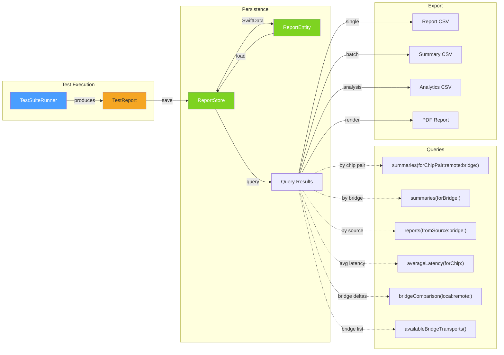

- `ReportStore` keeps lightweight `ReportSummary` values in memory and loads full report bodies on demand (`loadFullReport(id:)`, `loadFullReports(ids:)`, `loadAllFullReports()`).
- **A failed store open never destroys data.** If `ModelContainer` cannot be created, `initError` is set and the app degrades to "reports unavailable" — the store on disk is left untouched, so a later launch can still recover it.
- `save(_:source:)` returns false when the report could not be persisted, and only adds the summary when persistence succeeded — a listed row whose body can never be loaded back is worse than no row.
- **CSV export escapes every string field** through `csvEscape`, so device names, error strings and phase names containing commas or quotes cannot corrupt the file.
- The PDF renders with fixed light colours rather than the current theme's dynamic colours, so a page generated in dark mode is not white-on-white when printed.

---

## Grading Algorithm

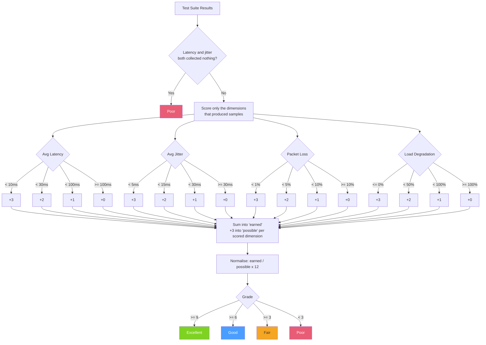

**Only dimensions that actually produced measurements are scored.** Latency counts when `sampleCount > 0`, jitter when `sampleCount > 0`, packet loss when `sent > 0`, and load degradation when `sampleCount > 0`. Each scored dimension contributes 3 points to `possible`; the earned total is then normalised as `earned / possible x 12` so the published 9 / 6 / 3 bands stay meaningful however many phases ran.

This matters because zero sits in the best-scoring band of every dimension. Scoring a phase that was disabled or that collected nothing would award it the full 3 points, so skipping work would *raise* the grade. If no dimension produced samples the grade is Poor, and a run where both latency and jitter came back empty is Poor before any scoring happens.

---

## Orchestration Protocol Messages

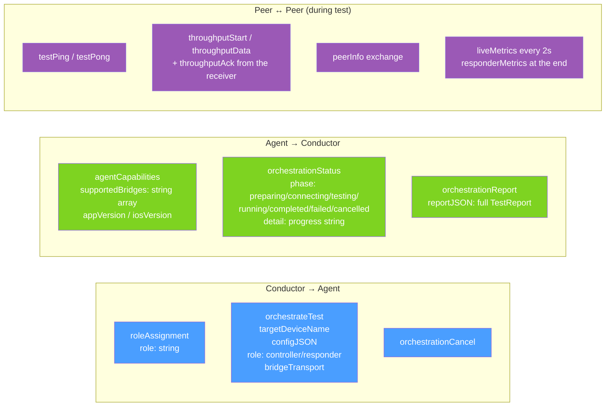

The `bridgeTransport` field on `orchestrateTest` is the only place a bridge is selected. Both agents act on it — the controller builds its outbound `ConnectionManager` with that transport, and the responder records it and uses it for the `ConnectionManager` it creates when accepting the partner connection — so the peer-to-peer traffic above genuinely crosses the bridge in both directions. `ConnectionManager` falls back to native and logs a warning if the named bridge is not registered, and the report is labelled with whatever transport the connection ended up using.

Standalone mode offers no bridge selection at all: its connection is already open and native, and a bridge has to be active on both ends for the comparison to mean anything. The Test Suite UI says so and points at Conductor mode for bridge comparison.
