# iPadDx — Current Architecture & Flows

How iPadDx works today. Native Swift on Network.framework with pluggable bridge transports. See [bridge_overhead.md](bridge_overhead.md) for bridge transport details.

---

## Component Stack

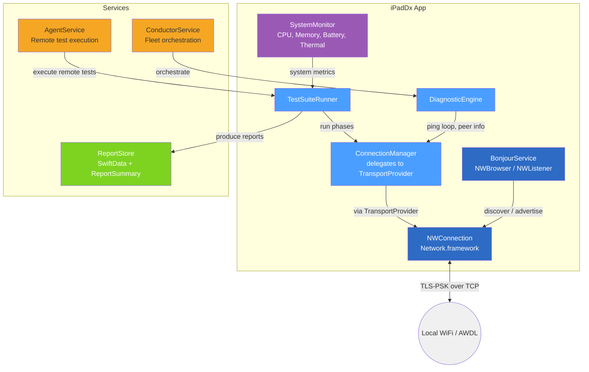

---

## Operating Modes

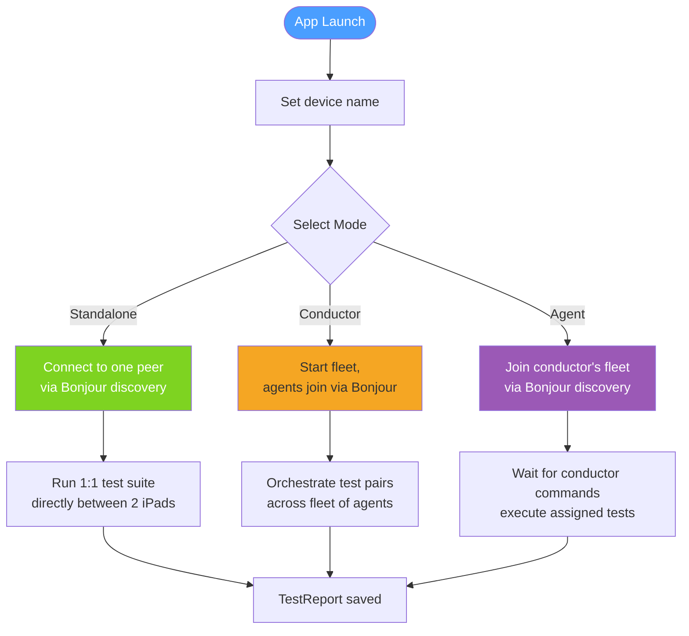

---

## Connection Lifecycle

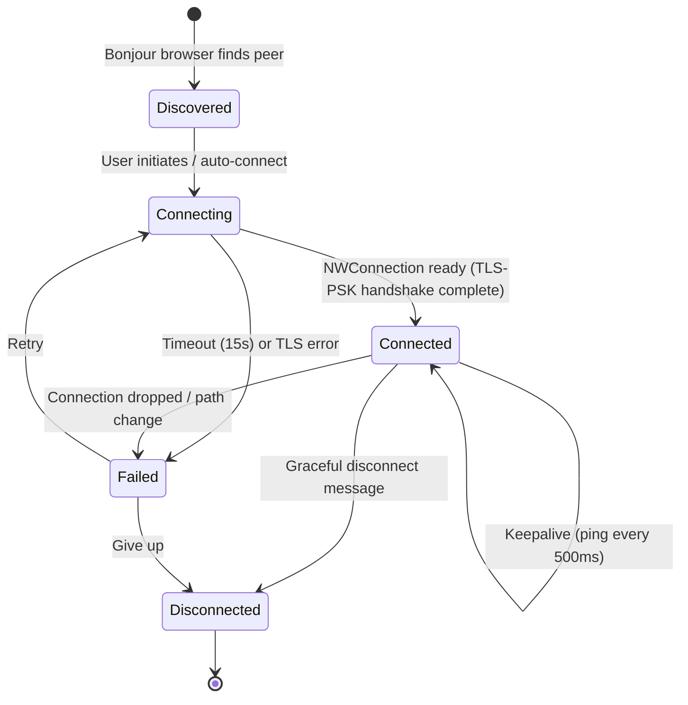

---

## Message Protocol

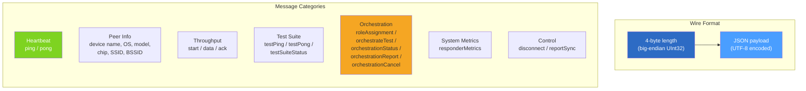

---

## Standalone Test Flow

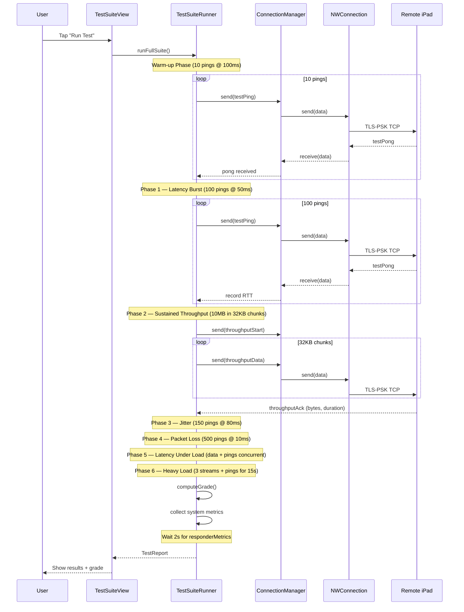

---

## Conductor Fleet Flow

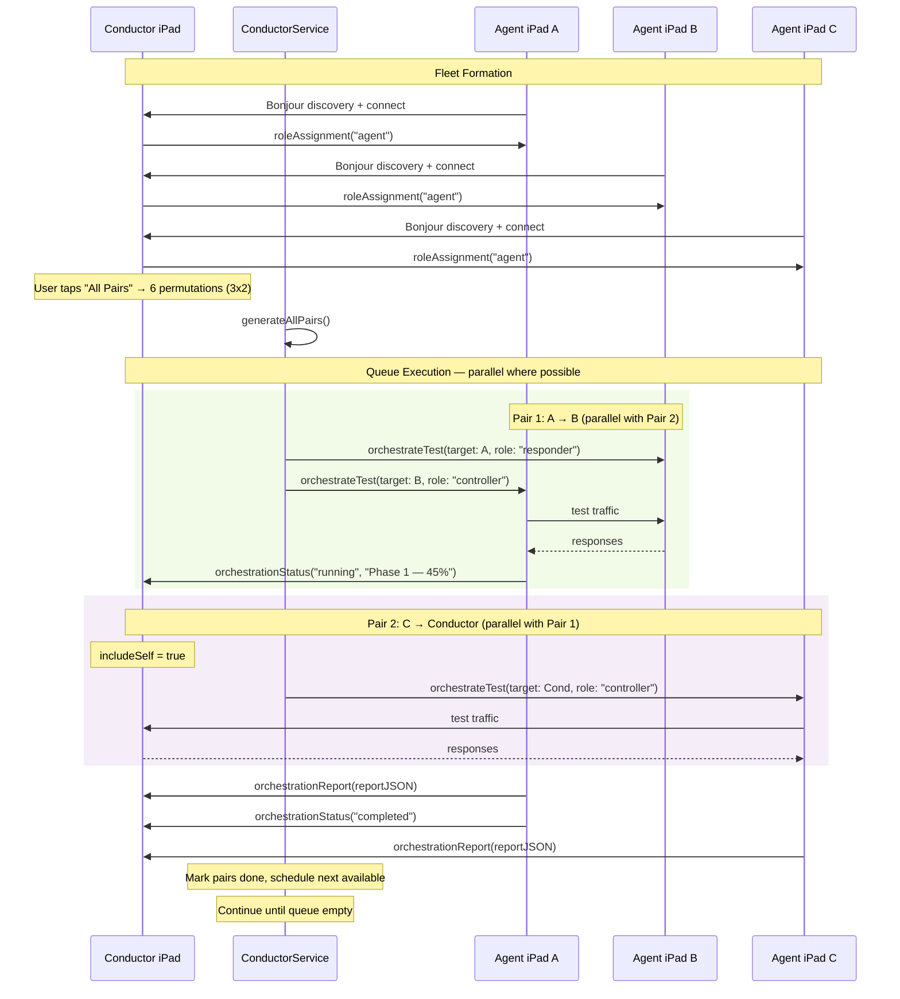

---

## Test Pair Generation

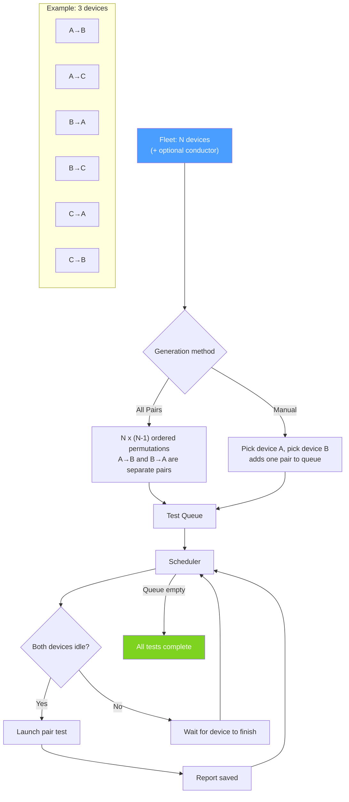

---

## Report Data Model

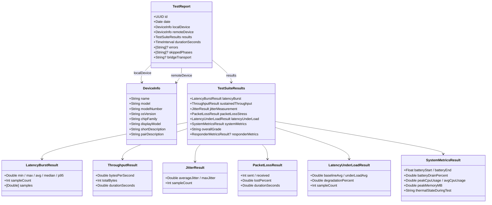

---

## Report Lifecycle

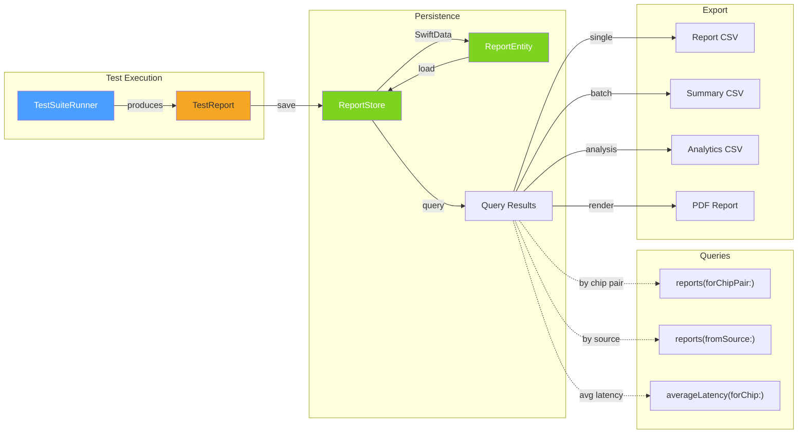

---

## Grading Algorithm

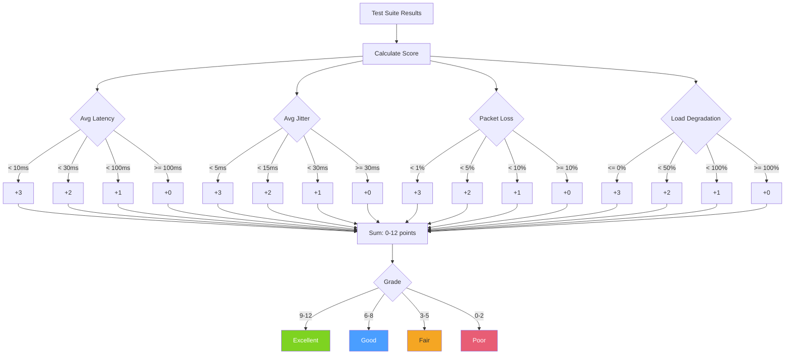

---

## Orchestration Protocol Messages

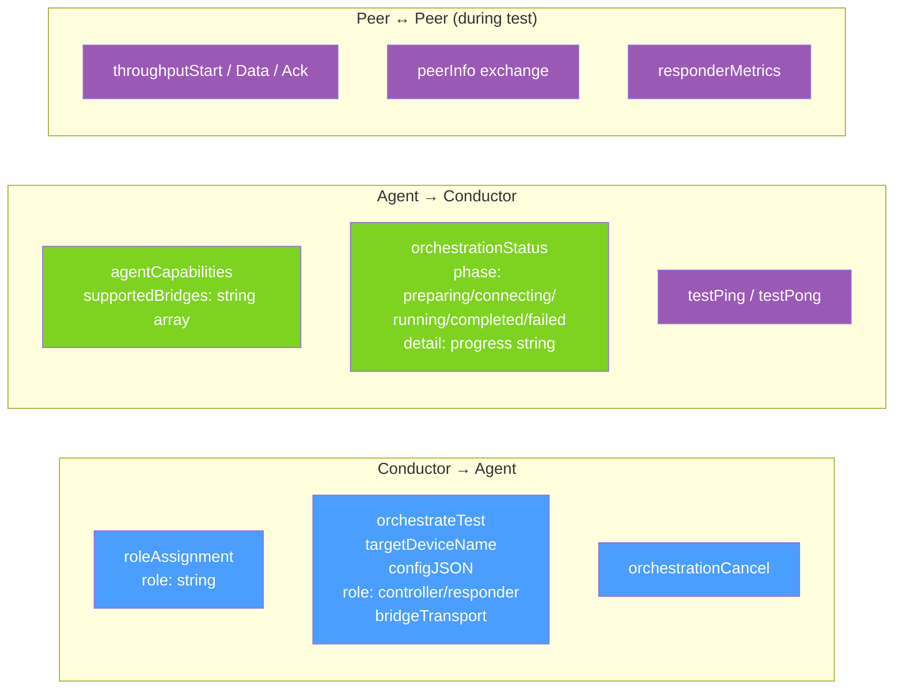
